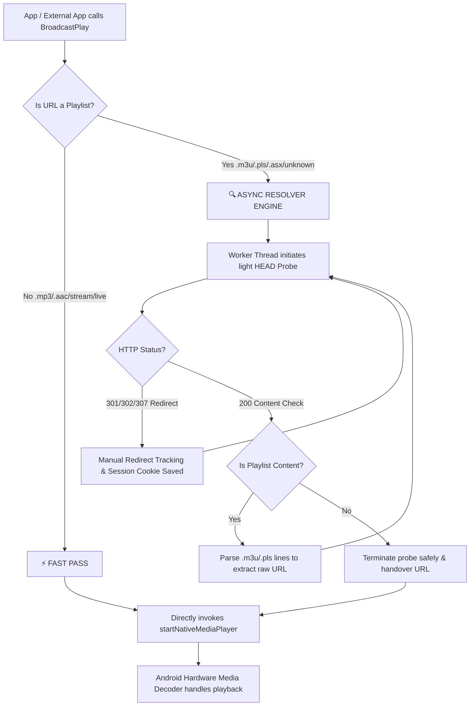

# BgRadio: Background Foreground Streaming Radio Service 📻

[](https://opensource.org)
[]()
[]()

A high-performance, non-visible Android extension (`.aix`) designed for playing internet radio and multimedia audio streams seamlessly in the background. Built on top of a pure Android native `MediaPlayer` with 100% zero external library dependencies.

## 📖 Table of Contents
- [Features](#-features)
- [Permissions Required](#-permissions-required)
- [Designer Properties](#-designer-properties)
- [Component Blocks & Methods](#-component-blocks--methods)
  - [Functions](#-functions)
  - [Events](#-events)
- [Installation Guide](#-installation-guide)
- [Best Practice Blocks Implementation](#-best-practice-blocks-implementation)

---

## ⚡ Features
- **Smart Bypass Engine:** Standard audio URLs (e.g., `.mp3`, `.aac`) skip network probing and pass directly to the hardware decoder for near-zero latency playback.
- **Asynchronous HEAD Resolver:** Parses complex playlist formats (`.m3u`, `.m3u8`, `.pls`, `.asx`) in a background thread using lightweight `HEAD` requests before falling back to `GET`, preventing network deadlocks.
- **Session Cookie & Redirect Tracking:** Hand-crafted engine handles cookie persistence and handles `301`/`302`/`307`/`308` location redirections manually.
- **Dynamic BigText Notification:** Built-in Android `BigTextStyle` foreground drawer card, allowing apps to push multi-line, long-text status payloads (e.g., live program info) without truncations.
- **Worldwide Radio Lookup:** Background client connected to the distributed Radio-Browser API, pre-filtering high-bitrate and video stream packets for mobile device safety.
- **Smart Auto-Resume:** Hardware persistence using `SharedPreferences` to instantly reload and resume the last played stream when an empty text parameter is received.

---

## 🔒 Permissions Required
This component automatically injects the following manifests upon compilation:
```xml
<uses-permission android:name="android.permission.INTERNET" />
<uses-permission android:name="android.permission.FOREGROUND_SERVICE" />
<uses-permission android:name="android.permission.FOREGROUND_SERVICE_MEDIA_PLAYBACK" />
<uses-permission android:name="android.permission.POST_NOTIFICATIONS" />
```

---

## 🎨 Designer Properties

| Property | Type | Access | Description |
| :--- | :--- | :--- | :--- |
| **AvailableCountries** | `YailList` | 🟢 Read | Returns a comprehensive pre-defined list of global country codes (e.g., TW, US, JP, ALL). |
| **AvailableGenres** | `YailList` | 🟢 Read | Returns a curated pre-defined list of main radio genres and music styles (e.g., Pop, Jazz, Classical). |
| **PlaybackState** | `String` | 🟢 Read | Fetches the real-time playback loop state (`Playing`, `Buffering`, `Stopped`, etc.). |
| **LastPlayedUrl** | `String` | 🟢 Read | Retrieves the last successfully verified audio stream URL from hardware persistence. |

---

## 🧱 Component Blocks & Methods

### 🚀 Functions
* 🔹 **`RegisterBroadcast()`**  
  Activates and registers the global `BroadcastReceiver`. Safely sets numerical flag `2` (`RECEIVER_EXPORTED`) to guarantee cross-app intent listening on Android 13 & 14+.

* 🔹 **`UnregisterBroadcast()`**  
  Terminates the global broadcast listener to release system memory context.
  

* 🔹 **`BroadcastPlay(String streamUrl)`**  
  Wakes up the background foreground service. **Smart Feature:** If an empty string `""` is passed, it automatically reads the internal `LastPlayedUrl` history to resume playback instantly.
  

* 🔹 **`BroadcastStop()`**  
  Stops audio decoding, releases MediaPlayer instances safely, and clears the active foreground drawer card.
  

* 🔹 **`BroadcastSearchStations(String country, String genre)`**  
  Queries the worldwide directory engine synchronously on a worker thread.
  

* 🔹 **`SetNotificationPayload(String topic, String message)`**  
  Injects custom string payload targets into the Android Notification card. Supports multi-line data.

* 🔹 **`StoreValue(String tag, Object valueToStore)`**
  Stores any type of variable (Text, Numbers, Boolean) persistently under a specific key (Tag) inside an isolated external SharedPreferences database.

* 🔹 **`GetValue(String tag, Object valueIfTagNotThere)`**
  Retrieves the value associated with the specified tag. It automatically infers the data type based on your provided default value fallback parameter.

### 📡 Events
* 🔸 **`OnStatusChanged(String status)`**  
  Fires dynamically when state updates occur (`Playing`, `Buffering`, `Stopped`, `Timeout Reconnecting`, `Connect Error: ...`).
  

* 🔸 **`OnRadioListReceived(String jsonList)`**  
  Triggered when directory search finishes. Filters out dead streams and low-bitrate artifacts, returning a clean JSON array string.
  

* 🔸 **`OnDebugLog(String logMessage)`**  
  Passes inner-resolver HTTP headers, connection trace states, and tracking routes for testing and debugging.
  
🔹 GetRadioSessionId()Returns the unique native Android AudioSessionID (integer) assigned to the active hardware decoder instance. Returns 0 if idle. Essential for developers who wish to interface with external Audio Effect Extensions, Equalizers, or real-time Visualizer spectrum animations.
---

## 💿 Installation Guide & Architecture

### 🛠️ Step-by-Step Installation
1. Go to the right sidebar of this repository, click on **[Releases]()**, and download the latest version of `com.luckyh9h.streamradio.aix`.
2. Open your development interface (**Niotron Studio** or **MIT App Inventor**).
3. Navigate to the **Palette** pane on the left, scroll down to the bottom, and expand the **Extension** section.
4. Click on **Import extension**, choose the downloaded `.aix` file, and click import.
5. Drag and drop the `BgRadio` component into your Viewer workspace. It will appear at the bottom as a *Non-visible component*.

### 🏗️ Underlying Architecture Flow
To deliver an ultra-responsive experience, the extension implements a high-efficiency dual-path routing system. Standard media endpoints completely bypass thread locks, while unverified playlists enter an asynchronous resolver loop:




## 🗺️ Best Practice Blocks Implementation

<details>
<summary><b>1. App Lifecycle Initialization</b></summary>

Always invoke `BgRadio1.RegisterBroadcast` in your `Screen1.Initialize` blocks block. This ensures that the global OS intent filter is safely mapped before any play triggers are sent.
</details>

<details>
<summary><b>2. Smart Play/Pause Toggle Integration</b></summary>

Use a standard conditional branch checking the property block:
- **IF** `BgRadio1.PlaybackState` == `"Playing"` ➡️ Call `BgRadio1.BroadcastStop`.
- **ELSE** ➡️ Call `BgRadio1.BroadcastPlay` with an empty string `""` text component.
</details>

<details>
<summary><b>3. Live Dynamic Metadata Updating</b></summary>

Before firing a play intent, you can dynamically format a string and pass it to `BgRadio1.SetNotificationPayload`. The expanded native Android notification pane will display your entire metadata description beautifully without clipping.
</details>

---

## 📄 License
This extension component repository is licensed under the terms of the **MIT License**. See the [LICENSE](LICENSE) file for more details.
